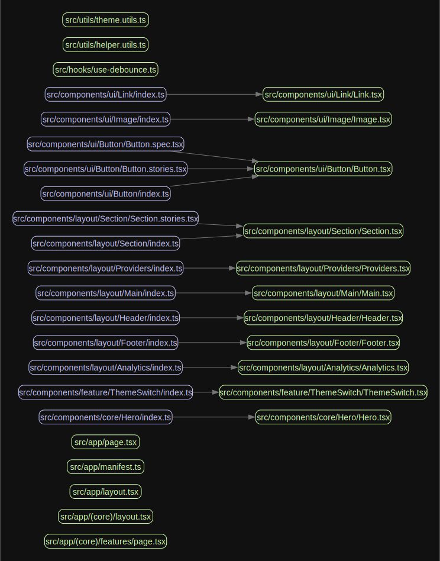

# Next Venture </br> [![GitHub Actions Workflow Status][check-workflow-badge]][check-workflow-badge-link] [![GitHub License][github-license-badge]][github-license-badge-link]

Welcome to _Next Venture_, a Next.js starter template packaged and pre configured with the latest industry standard dev features, so you can focus on developing your next product.

## Development

### Features

Next Venture is packaged with the following dev features:

- 🏎️ **[Next.js](https://nextjs.org/)** - Fast by default, with config optimized for performance (with **App Directory**)
- 💅 **[Tailwind CSS](https://tailwindcss.com/)** - A utility-first CSS framework for rapid UI development
- ✨ **[ESlint](https://eslint.org/)** and **[Prettier](https://prettier.io/)** - For clean, consistent, and error-free code
- 🛠️ **[Extremely Strict TypeScript](https://www.typescriptlang.org/)** - With [`ts-reset`](https://github.com/total-typescript/ts-reset) library for ultimate type safety
- 🚀 **[GitHub Actions](https://github.com/features/actions)** - Pre-configured actions for smooth workflows, including Bundle Size and performance stats
- 💯 **[Perfect Lighthouse Score](https://developer.chrome.com/docs/lighthouse/overview)** - Because performance matters
- ⚙️ **[Next Bundle Analyzer](https://www.npmjs.com/package/@next/bundle-analyzer)** - Keep an eye on your bundle size
- 🦺 **[Jest](https://jestjs.io/)** and **[React Testing Library](https://testing-library.com/react)** - For rock-solid unit and integration tests
- 🧪 **[Playwright](https://playwright.dev/)** - Write end-to-end and integration tests like a pro
- 🎉 **[Storybook](https://storybook.js.org/)** - Create, test, and showcase your components
- 🚬 **[Smoke Testing and Acceptance Tests](https://storybook.js.org/docs/writing-tests)** - For confidence in your deployments
- 🦊 **[Husky for Git Hooks](https://typicode.github.io/husky/)** - Git hooks made easy with Husky
- 🚫 **[Lint-staged](https://github.com/lint-staged/lint-staged)** - For running linters on Git staged files
- 🚓 **[Commitlint](https://commitlint.js.org/)** - Linting for git commits with Commitlint
- 💡 **[Absolute Imports](https://nextjs.org/docs/advanced-features/module-path-aliases)** - Simplified imports with absolute imports using the `@` prefix
- 🏄 **[Next UI](https://nextui.org/)** - Beautiful, fast and modern React UI library
- 🎨 **[Tailwind Variants](https://www.tailwind-variants.org/)** - The power of Tailwind combined with a first-class variant API
- 📝 **[Automated Package Patching](https://www.npmjs.com/package/patch-package)** - Fix external dependencies without losing your mind
- 📈 **[Components Coupling and Cohesion Graphs with Madge](https://github.com/pahen/madge)** - A tool for visually managing component relationships
- 🤖 **[Automated ChatGPT Code Reviews](https://openai.com/chatgpt)** - Stay on the cutting edge with AI-powered code reviews! Great for solo developers and startups.
- 🎁 **[Semantic Release](https://github.com/semantic-release/semantic-release)** - for automatic changelog generations
- 💻 **[T3 Env](https://env.t3.gg/)** - Manage your environment variables with ease

#### Additional Features

Next.js has more features for an enhanced development experience:

- **[Minified Build](https://nextjs.org/docs/pages/building-your-application/deploying)** - Next.js automatically generates optimized builds.
- **[Live Reload](https://nextjs.org/docs/architecture/fast-refresh)** - Next.js will handle live reloading your changes without any additional hassle.
- **[Cache Busting](https://nextjs.org/docs/app/building-your-application/caching)** - Next.js improves your app's performance with caching.

### Requirements

- `node@^20.11.0`
- `yarn@^1.22.19`

### Table of Contents

- [Next Venture](#next-venture-----)
  - [Features](#features)
  - [Table of Contents](#table-of-contents)
  - [Getting Started](#-getting-started)
  - [Commit Format](-#-commit-format)
  - [Deployment](#-deployment)
  - [Scripts Overview](#-scripts-overview)
  - [Coupling Graph](#-coupling-graph)
  - [Testing](#-testing)
    - [Running Tests](#running-tests)
    - [Acceptance Tests](#acceptance-tests)
    - [Smoke Testing](#smoke-testing)
  - [Styling and Design System](#-styling-and-design-system)
    - [Tailwind Variants](-#tailwind-variants---a-tailwind-approach-to-variants)
  - [State Management](#-state-management)
  - [ChatGPT Code Reviews](#-chatgpt-code-reviews)
  - [Environment Variables Handling](#-environment-variables-handling)
  - [Contribution](#-contribution)
  - [License](#-license)
  - [Kudos](#-kudos)

### 🎯 Getting Started

To get started with development for this app, follow these steps:

1. Fork & clone repository:

```bash
## Don't forget to ⭐ star and fork it first :)
git clone https://github.com/withpulp/next-venture.git
```

2. Install the dependencies:

```bash
yarn ci
```

3. Run the development server:

```bash
yarn dev
```

4. Open [http://localhost:3000](http://localhost:3000) with your browser to see the result.

### Commit Format

Commit messages must include a type prefix, following this format: `type: commit message`. See the recommended [commit message guidelines](https://github.com/angular/angular/blob/22b96b9/CONTRIBUTING.md#-commit-message-guidelines) for more info.

#### Commit Types

Commit types categorize the nature of the changes made in the commit, providing clarity and structure to the project's history. These are required by `semantic-release` which is used for generating a CHANGELOG without the need for manual input.

Here's a brief description of each commit type:

- **`feat`**: Introduces a new feature to the codebase.
- **`fix`**: Fixes a bug in the codebase.
- **`perf`**: Improves performance of the codebase.
- **`refactor`**: Refactors existing code without changing its behavior or adding new features.
- **`style`**: Addresses cosmetic changes that do not affect the meaning of the code (e.g., formatting, semi-colons).
- **`test`**: Adds missing tests or corrects existing tests.
- **`build`**: Affects the build system or external dependencies (Example scopes: gulp, broccoli, npm).
- **`ops`**: Changes related to operational tasks or systems administration.
- **`docs`**: Documentation-only changes.
- **`chore`**: Other changes that don't modify `src` or `test` files.
- **`merge`**: Merge branches or integrate changes from another source.
- **`revert`**: Reverts a previous commit.
- **`ci`**: Changes to CI configuration files and scripts (Example scopes: Travis, Circle, BrowserStack, SauceLabs).

These are set with `commitlint/config-conventional`, [read the docs](https://github.com/conventional-changelog/commitlint?tab=readme-ov-file#what-is-commitlint) for more info.

### 🚀 Deployment

#### Vercel

Easily deploy your app with [Vercel](https://vercel.com/new?utm_medium=default-template&filter=next.js&utm_source=github&utm_campaign=next-enterprise) by clicking the button below:

[](https://vercel.com/new/git/external?repository-url=https://github.com/withpulp/next-venture)

### 📃 Scripts Overview

The following scripts are available in the `package.json`:

#### Continuous Integration Scripts

- **`ci`**: Installs dependencies based on the `yarn.lock` file without updating it, ensuring consistent dependency resolution in continuous integration environments. This command is crucial for making sure that the installed packages match the versions tested and approved for the project, thereby avoiding discrepancies between development, testing, and production environments.

#### Development Scripts

- **`dev`**: Launches the development server with enhanced, colorized console output, making it easier to read logs and errors during development.

#### Building and Starting the App

- **`build`**: Compiles the application for production deployment using Next.js' build command.
- **`start`**: Starts a Next.js production server to serve your built application. This command is typically used after `build` to preview your application in a production-like environment locally or in production.

#### Linting and Formatting

- **`lint`**: Runs ESLint to identify and report on patterns found in ECMAScript/JavaScript code, helping you to fix problems and adhere to consistent coding styles.
- **`lint:fix`**: Automatically fixes as many linting issues as possible.
- **`prettier`**: Checks all supported files for formatting issues against Prettier rules.
- **`prettier:fix`**: Automatically formats code, fixing any formatting issues detected by Prettier.
- **`format`**: A convenience script that runs both `lint:fix` and `prettier:fix`, ensuring your codebase is both lint and format compliant with a single command.

#### Analysis and Visualization

- **`build:analyze`**: Generates an analysis of your bundle sizes, useful for identifying large dependencies or chunks that might affect load times.
- **`gen:coupling-graph`**: Creates a visual graph of component dependencies within your project, helping identify tightly coupled components and potential areas for refactoring towards higher cohesion and looser coupling.

#### Storybook

- **`storybook`**: Starts the Storybook development environment, allowing you to develop and test UI components in isolation.
- **`storybook:test`**: Executes Storybook's built-in smoke tests to ensure that your Storybook configuration and components render without errors.
- **`storybook:build`**: Compiles your Storybook into a static web application, ready to be deployed to any static hosting service.

#### Testing

- **`test`**: Runs unit tests with Jest, providing feedback on test outcomes and code coverage.
- **`test:e2e`**: Executes end-to-end tests using Playwright in a headless browser, ideal for CI environments.
- **`test:e2e-ui`**: Runs end-to-end tests with Playwright with the browser UI visible, useful for debugging tests interactively.

#### Maintenance and Setup

- **`clean:builds`**: Removes build artifacts and caches that may affect subsequent builds, ensuring that your next build is clean.
- **`clean:reports`**: Clears out generated reports from tests or analyses, freeing up space and ensuring that new reports are easily identifiable.
- **`clean:modules`**: Deletes the `node_modules` directory, often a troubleshooting step to resolve issues with dependencies.
- **`clean:all`**: A comprehensive cleanup command that runs all the `clean:` scripts in sequence.
- **`clean:install`**: Performs a full cleanup and then reinstalls dependencies, useful for ensuring a consistent development environment.
- **`prepare`**: Sets up Git hooks using Husky to ensure code standards and tests are checked before commits and pushes. This script is automatically run after dependencies are installed and helps to maintain code quality and consistency across the project.
- **`preinstall`**: Enforces the use of Yarn for package management by checking the environment before installing packages.
- **`postinstall`**: Applies custom patches to installed packages, ensuring that any necessary modifications to dependencies are made after installation.

### 🔗 Coupling Graph

The `gen:coupling-graph` script is a useful tool that helps visualize the coupling and connections between your project's internal modules. It's built using the [Madge](https://github.com/pahen/madge) library. To generate the graph, simply run the following command:

```bash
yarn gen:coupling-graph
```

This will create a `graph.svg` file, which contains a graphical representation of the connections between your components. You can open the file with any SVG-compatible viewer.



### 🧪 Testing

This dev environment comes with various testing setups to ensure your application's reliability and robustness.

#### Running Tests

- **Unit and integration tests**: Run Jest tests using `yarn test`
- **End-to-end tests (headless mode)**: Run Playwright tests in headless mode with `yarn test:e2e`
- **End-to-end tests (UI mode)**: Run Playwright tests with UI using `yarn test:e2e-ui`


#### Acceptance Tests

To write acceptance tests, we leverage Storybook's [`play` function](https://storybook.js.org/docs/react/writing-stories/play-function#writing-stories-with-the-play-function). This allows you to interact with your components and test various user flows within Storybook.

```ts
/*
 * See https://storybook.js.org/docs/react/writing-stories/play-function#working-with-the-canvas
 * to learn more about using the canvasElement to query the DOM
 */
export const FilledForm: Story = {
  play: async ({ canvasElement }) => {
    const canvas = within(canvasElement);

    const emailInput = canvas.getByLabelText("email", {
      selector: "input",
    });

    await userEvent.type(emailInput, "example-email@email.com", {
      delay: 100,
    });

    const passwordInput = canvas.getByLabelText("password", {
      selector: "input",
    });

    await userEvent.type(passwordInput, "ExamplePassword", {
      delay: 100,
    });
    // See https://storybook.js.org/docs/react/essentials/actions#automatically-matching-args to learn how to setup logging in the Actions panel
    const submitButton = canvas.getByRole("button");

    await userEvent.click(submitButton);
  },
};
```

#### Smoke Testing

In this app, we use Storybook's out-of-the-box support for smoke testing to verify that components render correctly without any errors. Just run `yarn storybook:test` to perform smoke testing. Remember to write stories in JSX or TSX format only. Smoke testing and a lot of other functionalities dont work well with MDX stories.

### 🎨 Styling and Design System

This app uses Tailwind CSS for styling and Tailwind Variants for creating a powerful, easy-to-use design system.

#### Tailwind Variants - A Tailwind Approach to Variants

While CSS-in-TS libraries such as [Stitches](https://stitches.dev/) and [Vanilla Extract](https://vanilla-extract.style/) are great for building type-safe UI components, they might not be the perfect fit for everyone. You may prefer more control over your stylesheets, need to use a framework like Tailwind CSS, or simply enjoy writing your own CSS.

Creating variants using traditional CSS can be a tedious task, requiring you to manually match classes to props and add types. Tailwind Variants is here to take that pain away, allowing you to focus on the enjoyable aspects of UI development. By providing an easy and type-safe way to create variants, Tailwind Variants simplifies the process and helps you create powerful design systems without compromising on the flexibility and control of CSS.

### 💾 State Management

[Jotai](https://github.com/pmndrs/jotai) is an atom-based state management library for React that focuses on providing a minimal and straightforward API. Its atom-based approach allows you to manage your state in a granular way while still being highly optimized for bundle size.

### 🤖 ChatGPT Code Reviews

We've integrated the innovative [ChatGPT Code Review](https://github.com/anc95/ChatGPT-CodeReview) for AI-powered, automated code reviews. This feature provides real-time feedback on your code, helping improve code quality and catch potential issues.

To use ChatGPT Code Review, add an `OPENAI_API_KEY` environment variable with an appropriate key from the OpenAI platform. For setup details, refer to the [Using GitHub Actions](https://github.com/anc95/ChatGPT-CodeReview#using-github-actions) section in the documentation.


### 💻 Environment Variables Handling

[T3 Env](https://env.t3.gg/) is a library that provides environmental variables checking at build time, type validation and transforming. It ensures that your application is using the correct environment variables and their values are of the expected type. You’ll never again struggle with runtime errors caused by incorrect environment variable usage.

The env config file is located in `src/libs/env.ts`. Simply set your client and server variables and import `env` from any file in your project.

```ts
export const env = createEnv({
  // Server variables
  server: {
    SECRET_KEY: z.string(),
  },
  // Client variables
  client: {
    API_URL: z.string().url(),
  },
  // Assign runtime variables
  runtimeEnv: {
    SECRET_KEY: process.env.SECRET_KEY,
    API_URL: process.env.NEXT_PUBLIC_API_URL,
  },
  // For Next.js >= 13.4.4, you only need to destructure client variables:
  // experimental__runtimeEnv: {
  //   API_URL: process.env.NEXT_PUBLIC_API_URL,
  // },
});
```

If the required environment variables are not set, you'll get an error message:

```sh
  ❌ Invalid environment variables: { SECRET_KEY: [ 'Required' ] }
```

### 🤝 Contribution

Contributions are always welcome! To contribute, please follow these steps:

1. Fork the repository.
2. Create a new feature branch with a `feat/` prefix.
3. Make your changes, and commit them using the [Conventional Commits](https://www.conventionalcommits.org/) format.
4. Push your changes to the forked repository.
5. Create a pull request, and wait for your changes to be reviewed.

#### Contributors

<!-- ALL-CONTRIBUTORS-LIST:START - Do not remove or modify this section -->
<!-- prettier-ignore-start -->
<!-- markdownlint-disable -->
<table>
  <tbody>
    <tr>
      <td align="center" valign="top" width="14.28%"><a href="https://damir.io/"><br /><sub><b>Damir Vazgird</b></sub></a><br /><a href="https://github.com/withpulp/next-venture/commits?author=withpulp" title="Code">💻</a></td>
    </tr>
  </tbody>
  <tfoot>
    <tr>
      <td align="center" size="13px" colspan="7">
        
          <a href="https://all-contributors.js.org/docs/en/bot/usage">Add your contributions</a>
        </img>
      </td>
    </tr>
  </tfoot>
</table>
<!-- markdownlint-restore -->
<!-- prettier-ignore-end -->

<!-- ALL-CONTRIBUTORS-LIST:END -->

### 📜 License

This project is licensed under the MIT License. For more information, see the [LICENSE](./LICENSE) file.

### 😇 Kudos

Lots of open source contributors have indirectly helped make this app possible, this section will outline some of them as thanks for their work and dedication to open source development.

- **[Blazity](https://github.com/Blazity)** - The starting point for this app was [Next.js Enterprise Boilerplate](https://github.com/Blazity/next-enterprise), which was used to generate the initial architecture.
- **[ixartz](https://github.com/ixartz)** - Various configs, particularly linting, typescript, and some github workflows was borrowed from [Next-js-Boilerplate](https://github.com/ixartz/Next-js-Boilerplate).

<!-- Badges and links -->

[check-workflow-badge]: https://img.shields.io/github/actions/workflow/status/blazity/next-enterprise/check.yml?label=check
[github-license-badge]: https://img.shields.io/github/license/blazity/next-enterprise?link=https%3A%2F%2Fgithub.com%2Fwithpulp%2Fnext-venture%2Fblob%2Fmain%2FLICENSE
[check-workflow-badge-link]: https://github.com/withpulp/next-venture/actions/workflows/check.yml
[github-license-badge-link]: https://github.com/withpulp/next-venture/blob/main/LICENSE
